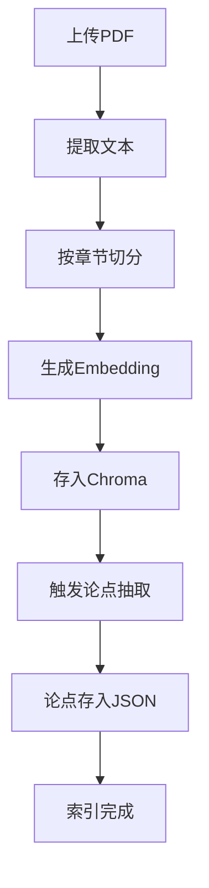
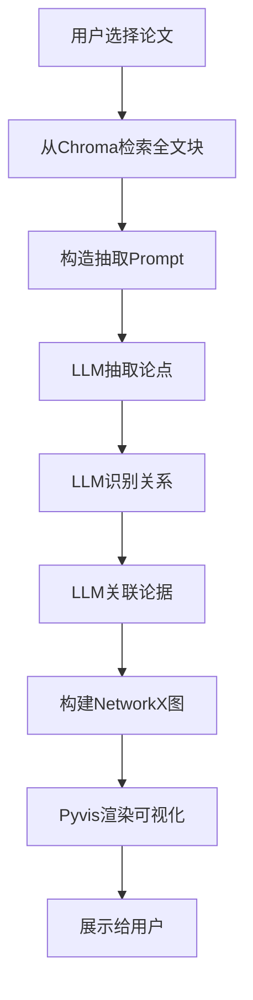
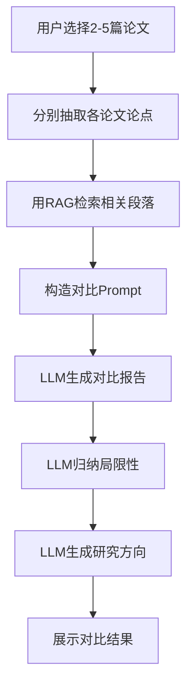

# 科研论文分析助手 PRD

## 一、项目概述

| 项目名称 | **PaperMind - 科研论文智能分析助手** |
|---------|----------------------------------|
| 项目口号 | 不只是检索论文，而是理解科研脉络 |
| 目标用户 | 计算机专业本科生/研究生、科研新手、准备写文献综述的研究者 |
| 核心价值 | 将单篇论文的论点结构化、多篇论文的对比智能化、未来研究方向建议自动化 |
| 时间预算 | 10-12天（MVP） |
| 技术栈 | LangChain, Chroma, OpenAI API, NetworkX, Pyvis, Streamlit, PyPDF2/PDFPlumber |

---

## 二、用户画像与痛点

### 用户画像

| 维度 | 描述 |
|-----|------|
| 身份 | 大三大四本科生 / 研一学生 |
| 场景 | 准备开题报告、写文献综述、了解一个新领域 |
| 技术背景 | 能读懂论文，但缺乏系统性分析工具 |
| 使用频率 | 每周2-3次，论文密集期每天使用 |

### 痛点分析

| 痛点 | 严重程度 | 现有方案的问题 |
|-----|---------|---------------|
| 读完论文记不住核心论点 | ⭐⭐⭐⭐⭐ | 手动做笔记太慢，且难以结构化 |
| 多篇论文对比困难 | ⭐⭐⭐⭐ | Excel表格手动整理，费时费力 |
| 找不到研究空白 | ⭐⭐⭐⭐ | 依赖导师指点或个人经验，缺乏系统方法 |
| 论据来源追溯麻烦 | ⭐⭐⭐ | 重新翻论文找原文，效率低 |

---

## 三、功能需求

### 3.1 功能全景图

```
┌─────────────────────────────────────────────────────────────┐
│                    PaperMind 功能架构                        │
├─────────────────────────────────────────────────────────────┤
│  ┌─────────────┐  ┌─────────────┐  ┌─────────────┐         │
│  │ 论文上传    │  │ 论文索引    │  │ 知识库管理  │         │
│  │ PDF/批量    │  │ 自动分块    │  │ 增删查      │         │
│  └─────────────┘  └─────────────┘  └─────────────┘         │
│                                                              │
│  ┌─────────────────────────────────────────────────────┐   │
│  │              核心分析引擎 (RAG + LLM)                 │   │
│  │  ┌───────────┐ ┌───────────┐ ┌───────────┐         │   │
│  │  │ 单篇分析  │ │ 多篇对比  │ │ 方向生成  │         │   │
│  │  │ 论点抽取  │ │ 差异归纳  │ │ 研究建议  │         │   │
│  │  │ 关系识别  │ │ 共性总结  │ │ 空白识别  │         │   │
│  │  │ 论据关联  │ │ 矛盾分析  │ │ 方法组合  │         │   │
│  │  └───────────┘ └───────────┘ └───────────┘         │   │
│  └─────────────────────────────────────────────────────┘   │
│                                                              │
│  ┌─────────────┐  ┌─────────────┐  ┌─────────────┐         │
│  │ 可视化展示  │  │ 问答交互    │  │ 报告导出    │         │
│  │ 论点网络图  │  │ 自然语言    │  │ Markdown    │         │
│  │ 对比热力图  │  │ 多轮对话    │  │ PDF/Word    │         │
│  └─────────────┘  └─────────────┘  └─────────────┘         │
└─────────────────────────────────────────────────────────────┘
```

### 3.2 功能清单（按优先级）

#### P0 - MVP必须实现

| 编号 | 功能模块 | 功能点 | 描述 | 验收标准 |
|-----|---------|-------|------|---------|
| F01 | 论文上传 | 单篇PDF上传 | 支持上传单篇PDF论文 | 能成功解析PDF文本 |
| F02 | 论文上传 | 批量上传 | 支持同时上传多篇论文 | 能批量处理，显示进度 |
| F03 | 索引构建 | PDF解析 | 提取PDF中的纯文本 | 保留章节信息、页码 |
| F04 | 索引构建 | 文本分块 | 按语义边界切分文本 | 每块500-1000字符，保留重叠 |
| F05 | 索引构建 | 向量化存储 | 存入Chroma向量数据库 | 能按问题检索相关块 |
| F06 | 单篇分析 | 论点抽取 | 提取论文核心论点列表 | 输出JSON格式，3-7个论点 |
| F07 | 单篇分析 | 关系识别 | 识别论点间的逻辑关系 | 支持supports/contradicts/elaborates/leads_to |
| F08 | 单篇分析 | 论据关联 | 每个论点关联到原文证据 | 能点击论点跳转到原文位置 |
| F09 | 可视化 | 论点网络图 | 用Pyvis展示论点关系 | 交互式节点-边图 |
| F10 | 基础问答 | 论文问答 | 基于RAG回答用户问题 | 答案能追溯到原文 |

#### P1 - 增强功能

| 编号 | 功能模块 | 功能点 | 描述 |
|-----|---------|-------|------|
| F11 | 多篇对比 | 核心论点对比 | 2-5篇论文的核心论点并列对比 |
| F12 | 多篇对比 | 局限性归纳 | 汇总各论文提到的局限性 |
| F13 | 多篇对比 | 差异点分析 | 识别不同论文方法的差异 |
| F14 | 方向生成 | 研究空白识别 | 基于局限性归纳研究空白 |
| F15 | 方向生成 | 研究方向建议 | 生成2-3个可行研究方向 |
| F16 | 报告导出 | Markdown导出 | 导出分析报告为Markdown文件 |

---

## 四、技术架构

### 4.1 整体架构图

```
┌─────────────────────────────────────────────────────────────────┐
│                        前端层 (Streamlit)                        │
│  ┌──────────┐ ┌──────────┐ ┌──────────┐ ┌──────────┐          │
│  │ 上传组件 │ │ 可视化区 │ │ 问答组件 │ │ 报告展示 │          │
│  └──────────┘ └──────────┘ └──────────┘ └──────────┘          │
└─────────────────────────────────────────────────────────────────┘
                              │ HTTP
┌─────────────────────────────────────────────────────────────────┐
│                       应用层 (Python)                            │
│  ┌─────────────────────────────────────────────────────────┐   │
│  │                    LangChain 编排层                       │   │
│  │  ┌─────────────┐ ┌─────────────┐ ┌─────────────────┐   │   │
│  │  │ 索引Pipeline│ │ 问答Chain   │ │ 分析Chain       │   │   │
│  │  │ Loader→     │ │ Retriever→  │ │ 论点抽取→       │   │   │
│  │  │ Splitter→   │ │ LLM→        │ │ 关系识别→       │   │   │
│  │  │ Embedding   │ │ Output      │ │ 综合推理        │   │   │
│  │  └─────────────┘ └─────────────┘ └─────────────────┘   │   │
│  └─────────────────────────────────────────────────────────┘   │
│  ┌─────────────┐ ┌─────────────┐ ┌─────────────┐              │
│  │ PDF解析模块 │ │ 可视化模块  │ │ 导出模块    │              │
│  │ pdfplumber  │ │ NetworkX    │ │ Markdown    │              │
│  │ PyPDF2      │ │ Pyvis       │ │ ReportLab   │              │
│  └─────────────┘ └─────────────┘ └─────────────┘              │
└─────────────────────────────────────────────────────────────────┘
                              │
┌─────────────────────────────────────────────────────────────────┐
│                       数据层                                     │
│  ┌─────────────────────────┐  ┌─────────────────────────┐      │
│  │   Chroma向量数据库       │  │   本地文件系统           │      │
│  │   - 文档块向量           │  │   - 原始PDF              │      │
│  │   - 元数据过滤           │  │   - 抽取的JSON结果       │      │
│  │   - 持久化存储           │  │   - 生成的报告           │      │
│  └─────────────────────────┘  └─────────────────────────┘      │
└─────────────────────────────────────────────────────────────────┘
```

### 4.2 技术选型详解

| 层级 | 技术 | 版本 | 选择理由 |
|-----|------|------|---------|
| 前端 | Streamlit | 1.28+ | 快速搭建，原生支持数据可视化 |
| 后端 | Python | 3.10+ | AI生态最完善 |
| LLM框架 | LangChain | 0.1+ | 简化RAG流程，展示工程能力 |
| 向量数据库 | Chroma | 0.4+ | 轻量级，本地持久化，无需云服务 |
| Embedding | OpenAI text-embedding-3-small | - | 效果好，成本低 |
| LLM | GPT-3.5-turbo / GPT-4o-mini | - | 推理能力强的同时控制成本 |
| PDF解析 | pdfplumber | 0.10+ | 表格/文本提取效果好 |
| 图谱处理 | NetworkX | 3.0+ | Python原生图库，易于集成 |
| 可视化 | Pyvis | 0.2+ | 生成交互式HTML，无需前端代码 |

### 4.3 数据模型设计

#### 论文元数据 (Paper Metadata)

```python
class Paper:
    id: str                    # UUID
    title: str                 # 论文标题
    filename: str              # 原始文件名
    file_path: str             # 存储路径
    upload_time: datetime      # 上传时间
    page_count: int            # 页数
    status: str                # indexing/completed/failed
```

#### 论点结构 (Argument Structure)

```python
class Argument:
    id: str                    # arg_001
    paper_id: str              # 所属论文
    statement: str             # 论点内容
    type: str                  # claim/hypothesis/conclusion
    position: str              # 位置 "Section 3.2, Page 5"
    
class Relation:
    source_arg_id: str         # 源论点ID
    target_arg_id: str         # 目标论点ID
    relation_type: str         # supports/contradicts/elaborates/leads_to
    
class Evidence:
    id: str
    argument_id: str           # 关联的论点ID
    source_text: str           # 原文片段
    source_location: str       # 页码/章节
```

#### 文档块Schema (Chroma Collection)

```python
{
    "id": "chunk_uuid",
    "text": "论文段落文本...",
    "metadata": {
        "paper_id": "paper_uuid",
        "paper_title": "Attention Is All You Need",
        "section": "3.2 Self-Attention",
        "page": 5,
        "chunk_index": 3,
        "argument_ids": ["arg1", "arg3"]  # 后续通过分析填充
    }
}
```

---

## 五、核心流程设计

### 5.1 索引进度流程



### 5.2 单篇论文分析流程



### 5.3 多篇论文对比流程



### 5.4 Prompt设计要点

#### 论点抽取Prompt模板

```python
EXTRACT_ARGUMENTS_PROMPT = """
你是一个科研论文分析专家。请从以下论文内容中提取核心论点。

论文内容：
{context}

要求：
1. 提取3-7个核心论点
2. 每个论点用一句话概括
3. 标注论点类型：claim(主张) / hypothesis(假设) / conclusion(结论)
4. 标注论点在原文中的位置（如果能推断）

输出格式（JSON）：
{{
  "arguments": [
    {{
      "id": "arg1",
      "statement": "论点内容",
      "type": "claim",
      "location": "Section 3, Page 4"
    }}
  ]
}}
"""
```

#### 关系识别Prompt模板

```python
IDENTIFY_RELATIONS_PROMPT = """
请分析以下论点之间的逻辑关系：

论点列表：
{arguments}

关系类型定义：
- supports: 论点A是论点B的证据或理由（A支持B）
- contradicts: 论点A与论点B矛盾
- elaborates: 论点B是论点A的具体展开（A细化为B）
- leads_to: 论点A导致论点B（因果）

输出格式（JSON）：
{{
  "relations": [
    {{"from": "arg1", "to": "arg2", "type": "supports"}}
  ]
}}
"""
```

#### 多篇对比Prompt模板

```python
COMPARE_PAPERS_PROMPT = """
请对比以下{num_papers}篇论文：

{paper_summaries}

请输出包含以下部分的分析报告：

## 1. 核心论点对比表
| 论文 | 核心方法 | 创新点 | 局限性 |

## 2. 共同点归纳
- 所有论文都认同...
- 共同采用的方法...

## 3. 差异点分析
- 论文A强调...，论文B更关注...
- 矛盾之处：...

## 4. 研究空白与未来方向
- 共同的局限性：...
- 可研究的方向：...
  1. ...
  2. ...
"""
```

---

## 六、界面与交互设计

### 6.1 页面结构

```
┌─────────────────────────────────────────────────────────────┐
│  PaperMind                                    [登录] [设置]  │
├─────────────────────────────────────────────────────────────┤
│  ┌─────────┐ ┌─────────────────────────────────────────┐   │
│  │ 侧边栏   │ │              主内容区                    │   │
│  │         │ │                                          │   │
│  │ 📁 论文库│ │ 当前：论文分析 - Attention Is All You Need│   │
│  │   - 论文1│ │ ┌─────────────────────────────────────┐ │   │
│  │   - 论文2│ │ │ 论点网络图（可交互拖拽）              │ │   │
│  │   - 论文3│ │ │                                     │ │   │
│  │         │ │ │    ○ 论点A                           │ │   │
│  │ 📊 分析  │ │ │      ↓ supports                     │ │   │
│  │   - 单篇 │ │ │    ○ 论点B ──→ ○ 论点C              │ │   │
│  │   - 多篇 │ │ │                                     │ │   │
│  │   - 对比 │ │ └─────────────────────────────────────┘ │   │
│  │         │ │                                          │   │
│  │ 💬 问答  │ │ 📝 论点详情                              │   │
│  │         │ │ 点击任意节点查看详情...                   │   │
│  └─────────┘ └─────────────────────────────────────────┘   │
└─────────────────────────────────────────────────────────────┘
```

### 6.2 关键交互

| 交互 | 触发方式 | 响应 |
|-----|---------|------|
| 上传论文 | 拖拽/点击上传 | 显示上传进度，自动开始索引 |
| 查看单篇分析 | 点击论文名称 | 右侧显示论点网络图 |
| 点击论点节点 | 鼠标点击节点 | 下方显示论据原文和引用位置 |
| 多篇对比 | 勾选多篇 + 点击“对比” | 弹出对比报告模态框 |
| 问答 | 输入问题 + 回车 | 显示答案 + 来源引用 |
| 导出报告 | 点击“导出” | 下载Markdown文件 |

---

## 七、项目结构与文件清单

```
PaperMind/
├── README.md                      # 项目说明
├── requirements.txt               # 依赖列表
├── .env.example                   # 环境变量模板
│
├── data/                          # 数据目录
│   ├── raw_pdfs/                  # 原始PDF文件
│   ├── parsed_json/               # 抽取的论点JSON
│   └── reports/                   # 导出的报告
│
├── chroma_db/                     # Chroma持久化目录（自动生成）
│
├── src/                           # 源代码
│   ├── __init__.py
│   ├── config.py                  # 配置管理（API Key等）
│   ├── pdf_loader.py              # PDF加载与解析
│   ├── indexer.py                 # 索引构建（分块+向量化）
│   ├── argument_extractor.py      # 论点抽取（核心）
│   ├── relation_identifier.py     # 关系识别（核心）
│   ├── multi_paper_analyzer.py    # 多篇对比分析
│   ├── rag_chain.py               # RAG问答链
│   ├── graph_builder.py           # NetworkX图构建
│   └── utils.py                   # 工具函数
│
├── app.py                         # Streamlit主入口
│
├── tests/                         # 测试
│   ├── test_pdf_loader.py
│   ├── test_argument_extractor.py
│   └── fixtures/                  # 测试用PDF
│
└── scripts/                       # 辅助脚本
    ├── batch_index.py             # 批量索引脚本
    └── export_report.py           # 报告导出脚本
```

---

## 九、测试用例

| 测试ID | 测试场景 | 输入 | 预期输出 |
|--------|---------|------|---------|
| TC01 | 单篇PDF上传 | 上传Attention论文 | 索引成功，显示论点图 |
| TC02 | 论点抽取 | 单篇论文 | 输出3-7个论点，格式正确 |
| TC03 | 关系识别 | 论点列表 | 输出2-5个关系，类型合法 |
| TC04 | 论据追溯 | 点击论点节点 | 显示原文片段和页码 |
| TC05 | 基础问答 | "这篇论文的核心创新是什么？" | 答案基于论文内容，带引用 |
| TC06 | 多篇对比 | 选择2篇同领域论文 | 输出对比报告，含共同点和差异 |
| TC07 | 方向生成 | 2-3篇论文 | 输出2-3个研究方向，合理可行 |
| TC08 | 边界情况 | 上传非论文PDF（如小说） | 提示"可能不是学术论文，分析效果有限" |
| TC09 | 边界情况 | 问题超出论文范围 | "未在论文中找到相关信息" |


## 简历话术（最终版）


**PaperMind：基于RAG的科研论文智能分析助手** | Python, LangChain, Chroma, OpenAI, NetworkX

• **RAG架构**：设计并实现端到端的RAG系统，支持多篇PDF论文的批量索引与语义检索，集成Chroma向量数据库实现毫秒级检索

• **论点结构抽取**：设计多轮Prompt工程，从论文中自动提取核心论点及逻辑关系（支持/矛盾/细化/因果），输出结构化知识图谱

• **多篇综合推理**：创新性地实现跨论文对比分析，通过LLM归纳研究空白并生成可研究方向，辅助科研选题

• **论据可追溯**：建立论点到原文的精确映射，每项分析结果均可追溯到具体章节和页码，确保可验证性

• **交互式可视化**：使用NetworkX + Pyvis构建可拖拽的知识网络图，支持节点点击查看详情

• **项目成果**：已成功分析6篇NLP领域顶会论文，生成3个有价值的研究方向建议


---

## 十二、风险与应对

| 风险 | 概率 | 影响 | 应对策略 |
|-----|------|------|---------|
| PDF解析效果差（扫描版） | 中 | 高 | 优先使用文字版PDF；未来可集成OCR |
| LLM抽取的论点质量不稳定 | 高 | 中 | 多轮Prompt调优；加入人工校验接口 |
| API调用超限 | 低 | 中 | 添加重试机制和指数退避 |
| 长论文超出上下文 | 中 | 中 | 分块处理，每块独立抽取后合并 |
| 多篇对比时输出过长 | 中 | 低 | 使用更便宜的模型，或限制对比篇数≤3 |
